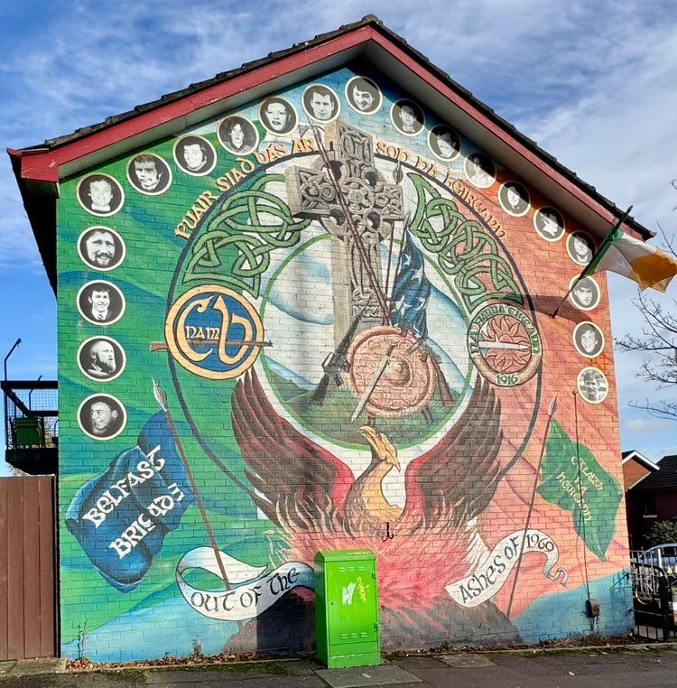

**22/06/41** : opération Barbarosa. En finir avec le Judeobolchévisme et espace vitale -> romp le pacte de non agression. 4 offensives :
- Leningrade
- Kiev -> chute le 19/09/41
- Moscou -> résiste
- Bakou -> résiste

Arrêt hiver 41
Peral Harbor -> entrée des us en guère 09/12/41-> fournit des armes
###### -> guerre dans le pacifique
Midway 2-4/06/42. Japonais perdent café mauvaise communication
###### -> guerre en Afrique
Reprise via Égypte de Algérie Maroc Tunisie Libie
###### -> URSS vainqueur
-> Stalinegrad 10/42 02/43 
-> 500k hommes envoyés
-> von palus se rend contre l'avis d'hitler
###### -> débarquement en Sicile 
10/07/43
24/07/43 -> Mussolini destitué et arrêté

## Une guerre d'anéantissement
### Violences & Crimes de guerre
Exactions contres pop ; pillages meutres & vX
1 Allemand = 50 civils
Russie et US aussi violents
Japonais pas sympa

Bombardements de but civils -> coventry -> blitz

### Génocides & crimes contres  l'humanité
#### Définitions
- Génocide : entrée dans les droits de l'ONU en 48
- Crime contre $H$ : créé à Nuremberg
#### Origines
- Antisémitisme au cœur de la théorie ratiale des $Nazis$