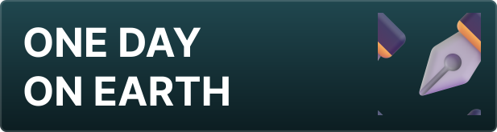

Docuception est une série de documentations reliés entre elles par un site web unique - l'*Inception* des documentations. Vous trouverez ici des [[TUTO/|tutoriels]], un [[BLOG/|blog]], des [[RESSOURCES/|ressources]] mais aussi des [[ODOE/|essais]] et des documents pour certains de mes projets (tel quel [[DEMOCRAFT/|DEMOCRAFT]] ou [[DREAMCLOUDS/|les DreamClouds]])

# 📒 Sections

    
    
    
    

Vous voulez tester le thème du site ? [[RESSOURCES/demo|Visitez la page de démo]] !
