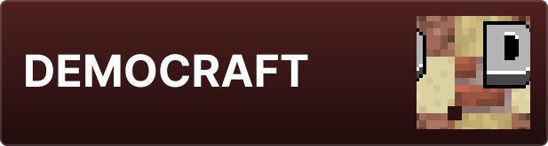

Docuception est une série de documentations reliés entre elles par un site web unique - l'*Inception* des documentations. Vous trouverez ici des [[TUTO/|tutoriels]], un [[BLOG/|blog]], des ressources mais aussi des [[ODOE/|essais]] et des documents pour certains de mes projets (tel quel [[DEMOCRAFT/|DEMOCRAFT]] ou [[DREAMCLOUDS/|les DreamClouds]])

# 📒 Sections

|        |       |
| ------------------------------------------- | ------------------------------------------ |
|        |  |

# 📦 Projets

|  |  |
| ---------------------------------------------------- | ---------------------------------------------------------- |
|                 |                       |
